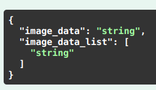
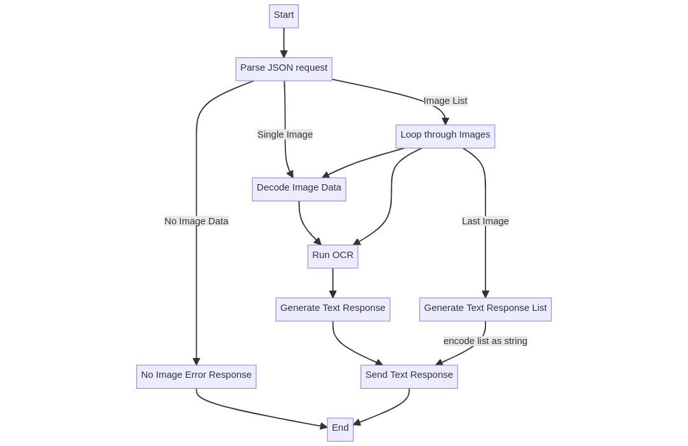
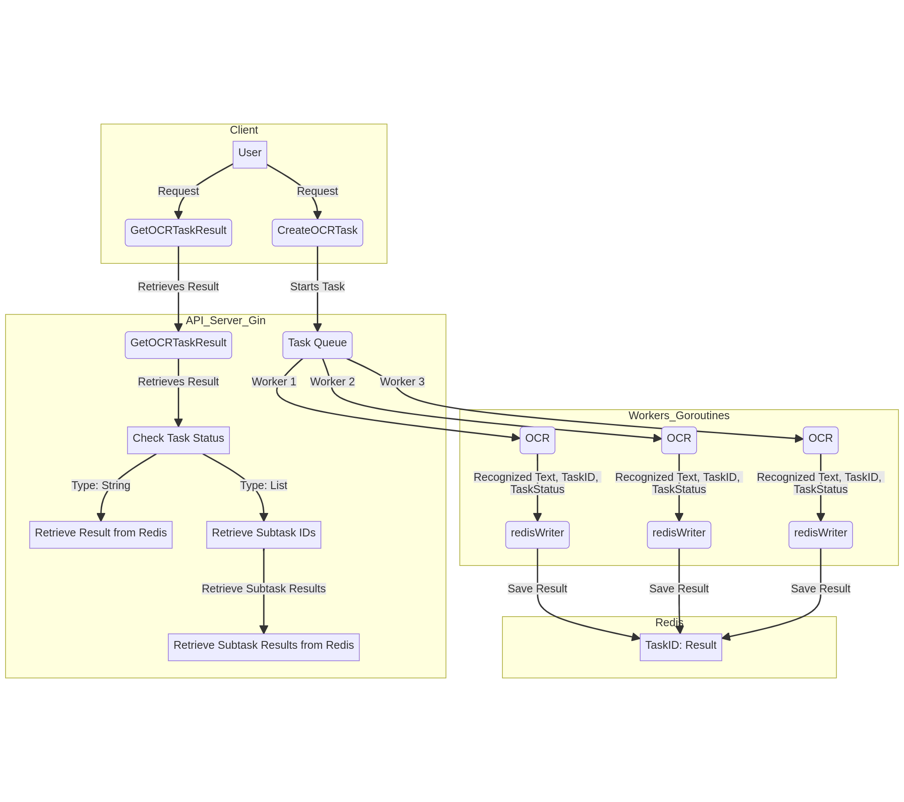

## Architecture Overview
- Worker pool is used to run tasks in background
- The APIs/workers use Redis for storging result and retrieval.
- goroutines used to run Workers concurrently (parallely for CPU with more than 1 core) 
- The task queue is implemented using golang channel
- ```NUM_TASK_WORKERS``` and ```MAX_BUFFERED_TASK``` can be modify from ```docker-compose.yaml``` file
- ```NUM_TASK_WORKERS``` used to set the maximum number of workers running in the background for processing the task, the workers are initialized as soon as the app is started, the workers then wait for receiving the task from queue 
- ```MAX_BUFFERED_TASK``` is the maximum number of task which can be inserted into task queue


## Run Instructions

- ```docker compose up```


## API access
http://localhost:5000/swagger/index.html

APIs can be tested with the swagger UI endpoint


## List of APIs (Description and Usage)

### 1. OCRSynchronous

Perform OCR on an image synchronously and return the recognized text.

- **Endpoint**: `http://localhost:5000/image-sync`
- **Method**: POST
- **Request Body**: ImageRequest 
- **Response**: {"text": "string"}
- **Usage**: 
    - Optional: generate base64 of desired image with [GetBase64](#getbase64)
    - send imageRequest (refer [Additional Notes](#additional-notes)  to know how to send single or batch images)
    - the response would return recognized text using Tesseact OCR

### CreateOCRTask

Create a background task for OCR on an image asynchronously and return a task ID.

- **Endpoint**: `http://localhost:5000/image`
- **Method**: POST
- **Request Body**: ImageRequest 
- **Response**: {"task_id": "string"}
- **Usage**: 
    - Optional: generate base64 of desired image with [GetBase64](#getbase64)
    - send imageRequest (refer [Additional Notes](#additional-notes) to know how to send single or batch images)
    - the response would return task_id which can be used in [GetOCRTaskResult](#getocrtaskresult) to fetch task result

### GetOCRTaskResult

Retrieve the result for a given task ID (asynchronous task).

- **Endpoint**: `http://localhost:5000/image`
- **Method**: GET
- **Query Params**: `task_id` (required)
- **Response**: {"task_id": "string"}
- **Usage**: 
    - send task_id as query param (as obtained from [CreateOCRTaks](#createocrtaks))
    - the response would return recognized-text in case of single image and for multiple images a list of recognized-text encoded as string 

### GetBase64

Upload an image file and get its base64 representation.

- **Endpoint**: `http://localhost:5000/upload`
- **Method**: POST
- **Request**: Multipart form data
- **Request Param**: `file` (image file)
- **Response**: Base64Response (JSON)

### Additional Notes

The OCR APIs handle various scenarios, including single images and image lists.
For demo I have created txt file for base64 request body, copy paste from them
- **Single Image Request**: ```readme-assets/single-image-request.txt```
- **Multiple Image Request**: ```readme-assets/batch-image-request.txt```

**ImageRequest**: the request body to send base64 image (both asynchronous and synchronous) is of form



- **For sending single Image**: use image_data
    Example: 
    ```json
    {  
        "image_data": "image1_base64"
    }
    ```
- **For sending batch of Images**: use image_data_list
    Example: 
    ```json
    {  
        "image_data_list": ["image1_base64, image2_base64, image3_base64, image4_base64, image5_base ..."]
    }
    ```
- **Leaving unnecessary commas might lead to error**

## Synchronous Design

 

## Asynchronous Design

 

